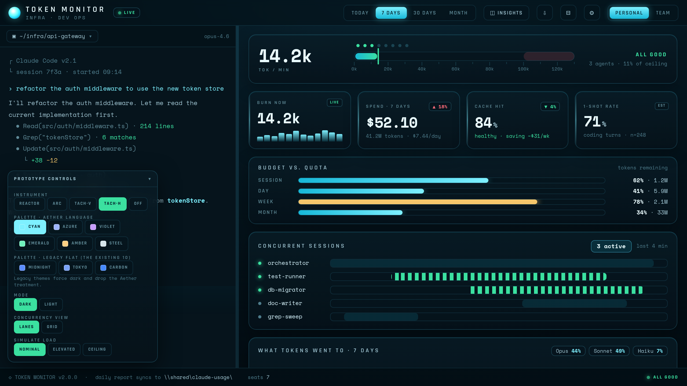
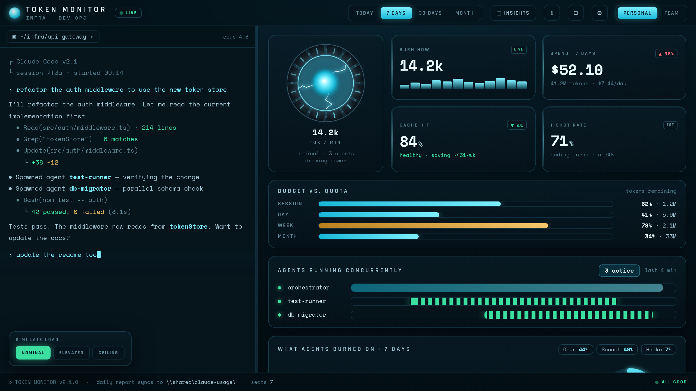
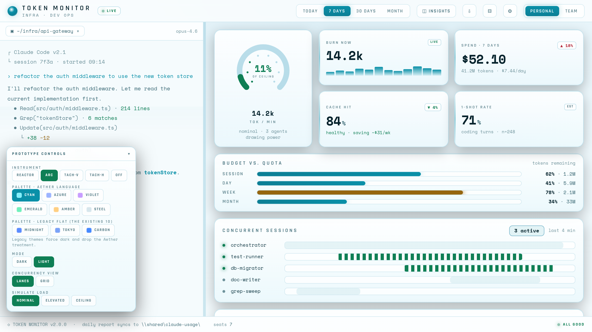
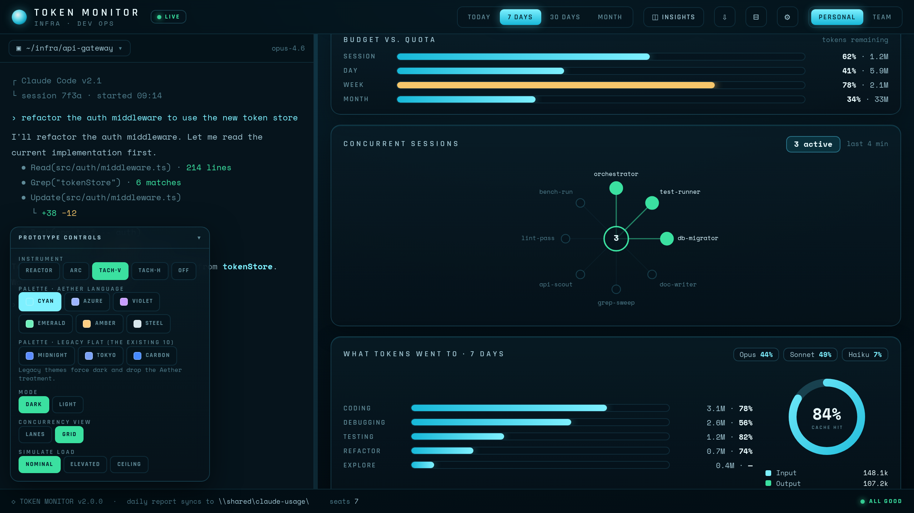
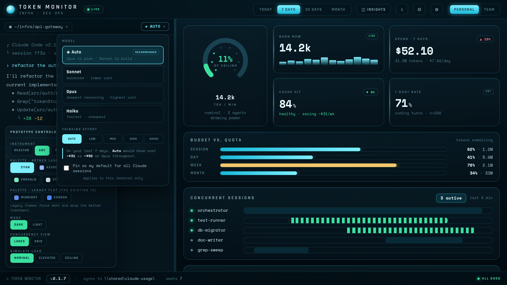
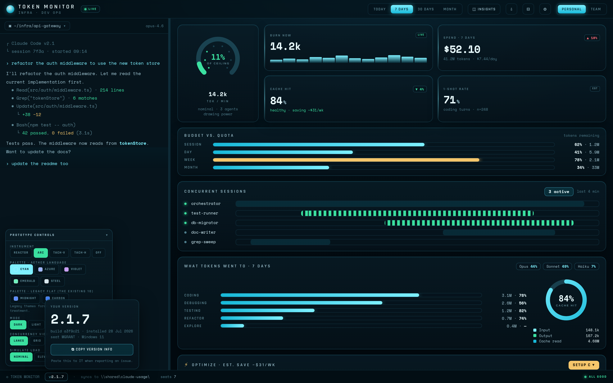

# TokenMonitor V2

The department build of **Claude Token Tracker** — a live Claude Code usage dashboard with an
embedded terminal, budgets, alerts, and a closed-loop cost optimizer that verifies its own fixes.

This repo is the v2 home. It currently holds the **shared core package**, the **version-readout
logic**, the **design system prototype**, and the **implementation plans**. The v1 Electron
application still lives in [`TokenMonitor`](https://github.com/mwgrant21/TokenMonitor); v2 is being
assembled here piece by piece rather than migrated in one jump.

**Status: pre-alpha.** What's here is verified and tested; what isn't here yet is listed honestly
below.

---

## What v2 is for

v1 was built for one person. v2 is built to be handed to an IT department where most people are new
to Claude Code, which changes almost every design decision:

- **Zero API cost, enforced.** Nothing in v2 may make a model call. Every number renders
  client-side from local transcript JSONL and the CLI's own `/usage` output — reads of work already
  paid for, never new billable calls. A `modelPolicyEnforcement`-style test that fails the build if
  `messages.create` becomes reachable is planned as a CI guardrail.
- **Teachable over feature-dense.** The dashboard reads top to bottom in order of *what do I need to
  know*: instrument → four headline numbers → budgets → concurrency → breakdown → optimize →
  treemap. A newcomer can be taught the first three and ignore the rest.
- **Guidance, not enforcement.** Nobody is blocked from choosing an expensive model. The app shows
  what that choice costs, computed from their own last 7 days.
- **No update server.** Rollout is manual. The app's job is to make its version trivially readable so
  a user can hand it over in one paste.

---

## What's in this repo

### `packages/core` — the shared logic package

Pure, dependency-free logic consumed by both TokenMonitor and
[Aether OS](https://github.com/mwgrant21/aether-os). No `fs`, no Electron, no network, no model
calls. TypeScript source, dual ESM + CJS output.

Both repos previously kept their own copy of `modelPricing`, `optimizeRules`, `optimizeGrade` and
`optimizeActions`. **The copies had already diverged in two ways that both test suites were blind
to** — each only ever exercised its own data shape:

| Divergence | Consequence |
|---|---|
| `eventTimestampMs` — Aether assumed a `Date`, TokenMonitor coerced strings | Aether's version **throws** on TokenMonitor's JSONL string timestamps, silently breaking the optimize loop's verify step |
| `findUncappedBashOutput` — Aether read `result.resultLength`, TokenMonitor read `e._rawResultLength` | Different fields entirely. Neither rule works on the other's data; TokenMonitor's double-counts multi-result events |

Both are resolved in `packages/core`, with comments explaining why the surviving code looks the way
it does. This is the same failure mode as the `usageTokens()` cache-token bug documented in Aether's
README: a test suite can be unanimously, confidently green and still wrong.

**Verification:** TokenMonitor's four original test files pass against the package *unmodified* —
only the `require` path rewritten. 43 assertions green, including an added ESM-entry suite.

```bash
npm install
npm run build:core
npm test
```

### `src/` + `test/` — version readout for manual rollout

`versionCheck.js` (pure) and `latestVersionReader.js` (one local file read) are combined in
`src/main/versionStatus.js` and exposed to the renderer as `version:getStatus`. A `latest.json`
dropped into the connected fleet folder is the entire update check — no server, no network request,
no bundled credential. The read rides the same 60s tick that already rescans session history; there
is no separate polling timer.

Three states, and the important one is `unknown`: a missing, unreachable or malformed `latest.json`
means *we do not know*, and must never render as "up to date". Silently claiming currency is exactly
the failure this replaces. The footer version chip and the Settings popover's Version line both
mirror the same status; the app only ever shows an `UPDATE AVAILABLE` chip when it actually is, and
stays silent otherwise.

**Publishing a build:** after cutting it and rolling it out to devices, drop this into the shared
fleet folder as `latest.json`:

```json
{ "version": "2.2.0", "notes": "tach instruments, palette rework", "published": "2026-08-04" }
```

Only `version` is read; `notes` and `published` are for humans reading the file and are safe to add.
**Update the file after the rollout, not before** — publishing it first makes every seat show
`UPDATE AVAILABLE` for a build nobody can get yet, which trains people to ignore the chip.

### `docs/prototype/index.html` — the v2 design system, clickable

A self-contained prototype of the v2 dashboard. Open it in a browser; controls are bottom-left.

- **Five instruments** — Reactor, Arc, Tach-V, full-width Tach-H (HUD), Off. Arc is the shipped
  default; only the Reactor animates, so the professional modes are also the cheap ones.
- **Five palettes** × light/dark, plus the legacy flat themes side by side for comparison.
- **Simulate load** — nominal / elevated / ceiling, cascading through one CSS variable.
- **Model + effort picker** and the **version readout**.

Fonts (Rajdhani, Space Mono) are inlined as base64 — it works offline, in Electron, with no CDN.

| | |
|---|---|
|  |  |
| Tach-H — full-width HUD strip | Reactor — opt-in, animated |
|  |  |
| Light mode | Orchestration grid |
|  |  |
| Model + effort picker, Auto by default | Version readout, built for reading back to IT |

### `docs/design/` and `docs/plans/`

- `aether-convergence-plan.md` — the full design rationale: what changed visually and why, the
  WCAG contrast audit that cut Tokyo Night, the accent-vs-alarm hue collision that cut Amber, the
  versioning findings, and an honest argument *against* the full React port.
- `model-selection-and-deployment.md` — verified Claude Code model and effort mechanisms, and how to
  package skills and agents for the department.
- `plans/` — task-by-task implementation plans in the repo's established format.

---

## Design decisions worth knowing

**Alarm colours never move.** Success, warn and danger are identical in every palette. An alert has
to mean the same thing on every desk in the department; only the accent changes. This is why Amber
was cut — its accent sat close enough to `--warn` that the dashboard read faintly alarmed at rest.

**Tokyo Night was cut on measurement, not taste.** It fails WCAG at `tx-muted` (2.76:1) and
`tx-dim` (2.31:1) against a 3:1 floor. Office glare compresses exactly that low-contrast end.

**"Auto" is `opusplan`, not a custom router.** Claude Code already switches Opus → Sonnet between
plan mode and execution. A router that reads the task to pick a model would need a model call per
turn — the exact API burn v2 forbids, spent on meta-work instead of work.

**`gradeBreakdown` has three scored factors plus context hygiene, not four.** `cost-of-thrash`
contributes to the `$/wk` total but has no grade row. Context hygiene is deliberately unscored: it's
a real signal with no dollar figure behind it, and folding it into the letter grade would make
"three green, one red" read worse than the math supports.

---

## Not here yet

Named rather than quietly omitted:

- The Electron application itself — main process, renderer, PTY, fleet roll-up. Still in v1.
- `buildInfo.json` generation and the automated version bump.
- The plugin/marketplace bundle for department onboarding.
- Wiring TokenMonitor and Aether OS to consume `packages/core` — plan written, not executed.

## How this is being built

Design and product decisions are mine; implementation runs through Claude Code against written
plans, with the plans themselves reviewed before execution. The two divergences documented above
were found by diffing the duplicated modules during extraction, not by either test suite — which is
the honest summary of what "verified" means here.

## License

MIT
